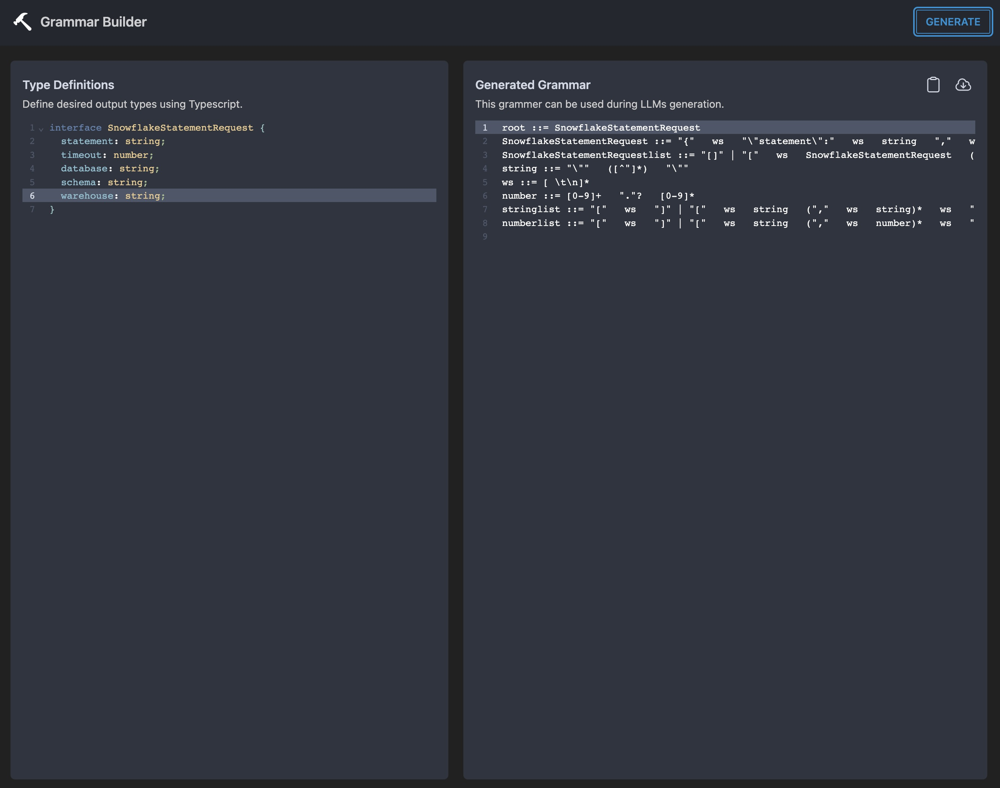

# grammar-builder

## ✨ _Checkout the live demo at https://grammar.intrinsiclabs.ai_ ✨

React app that lets you generate llama.cpp-compatible grammar files from simple TypeScript interfaces.

* Uses [@intrinsicai/gbnfgen](https://github.com/intrinsiclabsai/gbnfgen/) under the hood for compilation from
TypeScript to grammars
* Built on top of [Vite](vitejs.dev) and [tailwindcss](https://tailwindcss.com/).
